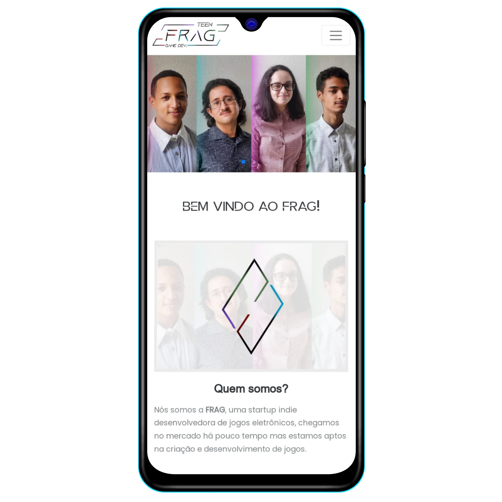

# TCC - Curso Técnico em Desenvolvimento de Sistemas
Esse trabalho de conclusão de curso foi feito por mim e meus colegas Giovanni, Renato e Ana Clara.  
Todo o projeto foi realizado em um site e utiliza as linguagens de programação: HTML 5 + CSS + JS, PHP, C# (Unity) e para armazenar os dados utilizamos o MySQL.  
Diante deste trabalho, temos o objetivo de demonstrar ao máximo o nosso crescimento e maturidade que adquirimos ao decorrer das aulas do ensino técnico.

* [Acesse o site clicando aqui](https://fernando-vinicius252.github.io/TCC-CursoTecnicoEmDS/)
